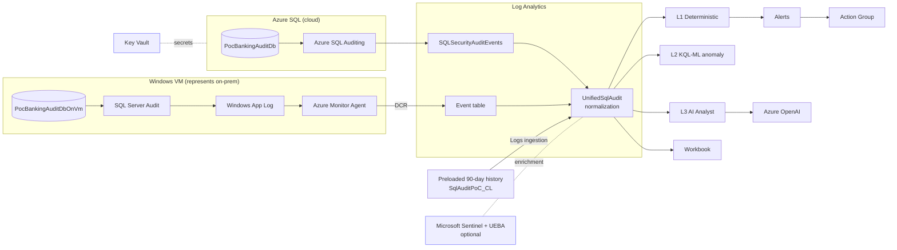

# Architecture — AI-Augmented SQL Audit & User Behavior Anomaly Detection (Contoso Bank PoC)

## Purpose

Prove, in a small **Azure-only** environment, that Contoso Bank can see **who** accessed **what
database records**, **when**, **from where**, and whether the behaviour is **normal or
abnormal** — even when the user holds legitimate elevated access — and have the AI layer
**explain the evidence**. The environment is **demo-ready immediately after deployment**:
90 days of history, baselines, anomaly scores, trend data and AI examples are preloaded.

## PoC constraints

- No QRC, no on-premises hardware, no Azure Arc. Everything runs in Azure.
- Small, cost-conscious, demo-grade (not production).
- Optional layers (Sentinel/UEBA, Azure OpenAI, AI Analyst Function) can be disabled and the
  demo still works.

## Diagram

See [../architecture.drawio](../architecture.drawio) (real Azure vendor icons).



## Components

| # | Resource | Role |
|---|----------|------|
| 1 | Resource Group `rg-sqlaudit-demo` | Container (Sweden Central) |
| 2 | Log Analytics Workspace (90-day retention) | Central audit + telemetry sink |
| 3 | Azure SQL server + `PocBankingAuditDb` | Cloud SQL; server-level auditing → LA |
| 4 | Windows Server 2022 VM + SQL 2022 Developer | `PocBankingAuditDbOnVm`; SQL Server Audit → App log |
| 5 | Azure Monitor Agent + Data Collection Rule | VM App log → LA `Event` table |
| 6 | Action Group + 7 Log Search alerts | Deterministic alerting |
| 7 | Two Azure Workbooks | Audit PoC + **AI Behavior Analytics** |
| 8 | Key Vault | Admin secrets |
| 9 | **Microsoft Sentinel** (optional) | Identity/entity UEBA enrichment |
| 10 | **Azure OpenAI** (optional) | `gpt-4o-mini` for the AI Analyst |
| 11 | **AI Analyst Function App** (optional) | Read-only explanation API |
| 12 | `SqlAuditPoC_CL` custom table | **Preloaded 90-day history** |

## Three detection layers (defence in depth)

1. **Layer 1 — Deterministic** (`kql/deterministic-detections.kql`, `infra/modules/alerts.bicep`):
   explainable rules — failed-login burst, high-risk statements, sensitive access, break-glass,
   permission escalation, schema tampering. These are the auditable foundation.
2. **Layer 2 — KQL-ML anomaly** (`kql/anomaly-detections-kql-ml.kql`): per-user baselines,
   `make-series` + `series_decompose_anomalies`, first-time access, volume/after-hours/out-of-role
   anomalies. Reduces the need to hand-write every static rule.
3. **Layer 3 — AI explanation** (`ai/functionapp`, optional): Azure OpenAI, **read-only**,
   grounded strictly in KQL evidence. Explains *why* something is suspicious, cites fields,
   suggests investigation steps. Never invents events, never executes SQL, never changes Azure.

## Data flow

```
Azure SQL ─ Auditing ─▶ SQLSecurityAuditEvents ─┐
SQL VM ─ SQL Audit ─ App Log ─ AMA ─ DCR ─▶ Event├─▶ UnifiedSqlAudit ─▶ L1/L2/L3 + Workbook + Alerts
Preloaded 90-day history ─ Logs ingestion ─▶ _CL ┘                              └─▶ Sentinel/UEBA (optional)
```

## Why preloaded history (demo-ready)

Platform tables (`SQLSecurityAuditEvents`, `Event`) record events at real time and cannot be
back-dated. To make baselines/trends/anomalies exist **immediately**, deployment seeds a
pre-normalized custom table **`SqlAuditPoC_CL`** via the Azure Monitor Logs ingestion (Data
Collector) API with back-dated `TimeGenerated`:

- **Days 1-85:** normal in-role behaviour (baseline).
- **Days 86-90:** gradual behavioural deviations (rising anomaly scores).
- **Current day:** major anomalies (break-glass, DBA after-hours, DELETE, escalation, spike).

`UnifiedSqlAudit` unions this table so every dashboard, baseline and anomaly query is populated
with no waiting. The presenter never generates training history during the demo.

## Why a VM instead of true on-prem

The VM (SQL Server Developer edition) stands in for the on-prem SQL system, exercising the real
**SQL Server Audit → Windows Event Log → Azure Monitor Agent → Log Analytics** path while keeping
the PoC Azure-only.

## Security / responsible-AI notes (PoC-grade)

- Admin secrets in **Key Vault**; system-assigned **managed identities** on SQL, VM, OpenAI, Function.
- The AI layer is **read-only** and grounded — see [ai-behavior-analytics-design.md](ai-behavior-analytics-design.md).
- Public network access is enabled for demo convenience; harden before real use
  ([post-deployment.md](post-deployment.md)).

## Cost profile

Serverless Azure SQL (auto-pause), a v2 B-series VM, `gpt-4o-mini` at low capacity, Consumption
Function App, PAYG Log Analytics (90-day retention on tiny volume). Tear down with `azd down --purge`.
